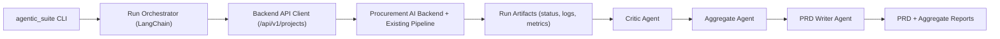

# PRD: Agentic Continuous Improvement Suite (LangChain, External Layer)

## 1. Problem Statement
Procurement AI already has a strong in-app sourcing pipeline, but improvement is mostly reactive. We need a dedicated system that repeatedly runs realistic product-search scenarios end-to-end, critiques outcomes, aggregates recurring failures, and translates evidence into prioritized implementation work.

## 2. Goals
- Build a separate agentic layer (outside `app/`) that drives the product only through backend APIs.
- Run 5-10 autonomous evaluations per suite cycle.
- Continue each run until completion or explicit interruption (timeout/cancel).
- Collect full evidence (status payloads, stage traces, logs, critique).
- Generate a PRD and prioritized workstreams from aggregate findings.

## 3. Non-Goals
- Rewriting production pipeline internals in this phase.
- Changing API contracts as part of evaluation layer rollout.
- Replacing existing in-product orchestration.

## 4. Users
- Product engineering leadership.
- Backend + AI engineers improving sourcing quality.
- QA/reliability owners for autonomous pipeline behavior.

## 5. Success Metrics
- Suite completion reliability: >= 80% successful runs.
- Median discovered suppliers per run: >= 12.
- Recommendation yield: >= 3 shortlisted suppliers in >= 70% of runs.
- Critical recurring failures reduced by 50% over 4 weeks.
- PRD-to-implementation latency: < 3 business days after suite execution.

## 6. System Architecture (Separate Layer)

### Separation Rule
- `agentic_suite/` must never import business logic modules from `app/agents/*`.
- Integration boundary is HTTP only.

## 7. Agent Roles

### 7.1 Clarification Continuation Agent
- Trigger: project reaches `clarifying` stage.
- Input: scenario context, clarifying questions, current parsed requirements.
- Output: field-to-answer mapping for `/api/v1/projects/{id}/answer`.
- Constraint: maximize continuation while minimizing risky assumptions.

### 7.2 Run Critic Agent
- Trigger: each run reaches terminal state.
- Input: run metrics + logs + final payload.
- Output: score, strengths, issues, root causes, actions.
- Constraint: prioritize actionable engineering fixes.

### 7.3 Aggregate Synthesis Agent
- Trigger: suite completion.
- Input: all run critiques and metrics.
- Output: recurring issues, preserved strengths, priority actions.

### 7.4 PRD Writer Agent
- Trigger: aggregate synthesis complete.
- Input: aggregate report + synthesis + scenario footprint.
- Output: structured PRD with workstreams, metrics, experiments, guardrails.

## 8. Prompt Strategy
Prompts are stored under `agentic_suite/prompts/`:
- `clarifier.md`
- `critic.md`
- `aggregate.md`
- `prd_writer.md`

Design principles:
- Strict structured JSON output.
- Explicit rubric and scoring dimensions.
- Priority bias toward high-leverage fixes.
- No generic “advice”; only implementable actions.

## 9. End-to-End Run Flow
1. Create project via `/api/v1/projects`.
2. Poll `/api/v1/projects/{id}/status`.
3. If clarifying questions appear, answer via clarification agent.
4. Continue polling until `complete|failed|canceled` or timeout.
5. Optional restart attempt on failure (`/restart`) within configured bounds.
6. Collect `/logs` and final payload.
7. Critique run.
8. Repeat until 5-10 runs complete.
9. Aggregate and generate PRD.

## 10. Data Artifacts
Per suite (`agentic_suite_outputs/<suite_id>/`):
- `runs/run-XX.json`
- `aggregate_report.json`
- `prd_structured.json`
- `PRD_AGENTIC_SUITE.md`
- `suite_manifest.json`

## 11. Reliability Controls
- Run timeout to prevent deadlocks.
- Bounded restart attempts.
- Bounded clarifying round trips.
- Log retention cap per run.
- Heuristic fallback when LLM unavailable.

## 12. 5-10 Run Protocol
- Minimum run count: 5.
- Maximum run count: 10.
- Use canonical scenario set with diverse product categories.
- Repeat scenarios cyclically when runs > scenario count.
- Keep prompt/version/config immutable within one suite cycle.

## 13. Implementation Plan

### Phase 1 (Now)
- Deliver external suite package with CLI and outputs.
- Ship prompt set + structured critique/synthesis/PRD pipeline.
- Enable live backend and dry-run modes.

### Phase 2
- Add historical suite registry and trend dashboard.
- Add diffing across suite cycles (week-over-week issue drift).
- Auto-create backlog tickets for recurring P0 issues.

### Phase 3
- Add nightly scheduled suites.
- Add scenario coverage growth strategy (new categories, geographies).
- Add rollout gates tied to score thresholds.

## 14. Risks and Mitigations
- Risk: noisy critiques when run telemetry is sparse.
  - Mitigation: enforce minimum artifact set and confidence scoring.
- Risk: overfitting to scenario set.
  - Mitigation: rotate scenarios and add periodic adversarial cases.
- Risk: evaluation layer drifts from product contracts.
  - Mitigation: keep API contract tests and schema validation in suite.

## 15. Acceptance Criteria
- Can execute 5-10 runs from CLI as an external layer.
- Captures logs, status, and critique per run.
- Produces aggregate report and PRD automatically.
- Requires no in-process dependency on runtime pipeline modules.
