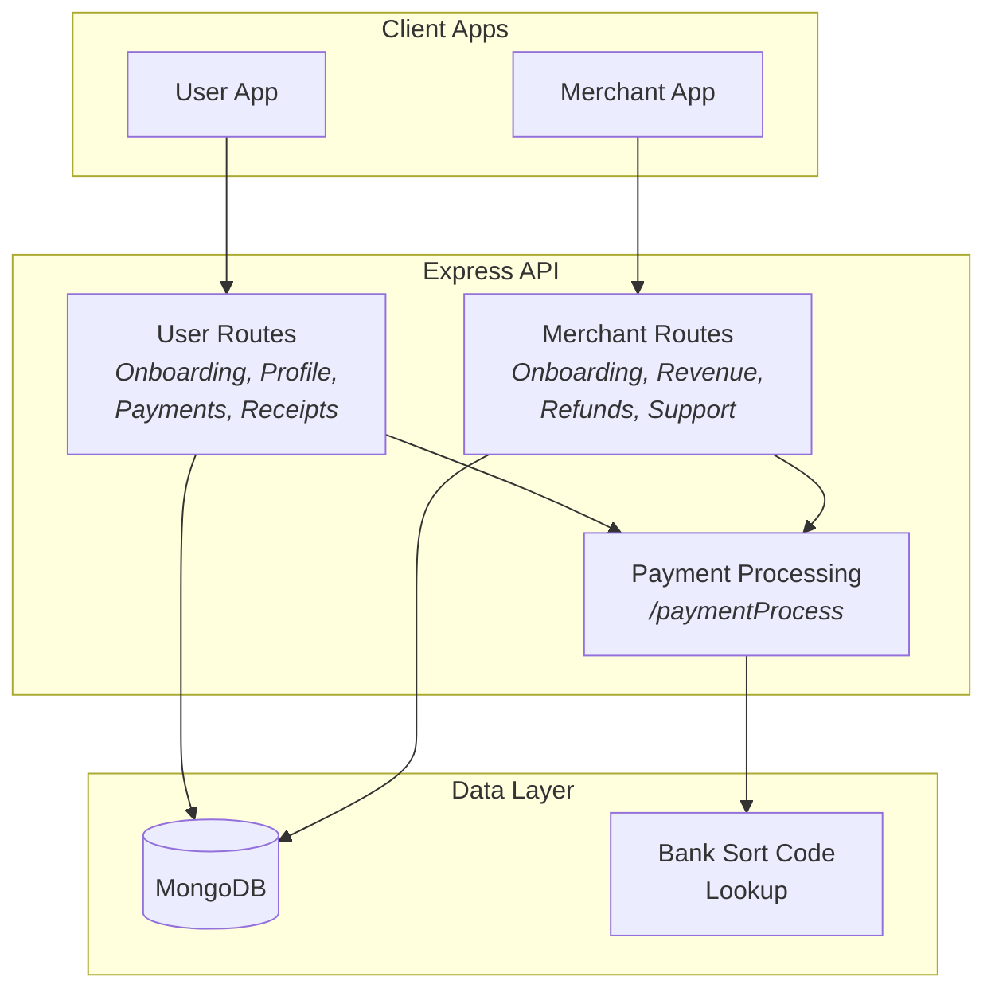

# PocketPay — Payment Processing Backend

A Node.js/Express backend implementing a dual user/merchant payment system with onboarding flows, verification, transaction processing, receipt generation, refund handling, and revenue tracking.


## What It Does

- **Dual Account System** — Separate user and merchant flows with independent onboarding, verification, and profile management
- **Payment Processing** — Transaction creation, payment confirmation, and financial institution integration page
- **Receipt Generation** — Automated receipt creation for completed transactions
- **Merchant Revenue Tracking** — Revenue dashboards and refund management for business owners
- **Bank Integration** — Sort code lookup for bank verification
- **Support Tickets** — In-app support system for both users and merchants

## Architecture



## Key Endpoints

**User Routes:** Onboarding, profile updates, verification, payment initiation, receipt retrieval

**Merchant Routes:** Onboarding, profile management, verification, revenue tracking, refund processing, support tickets

**Shared:** Bank sort code lookup, payment processing page

## Tech Stack

| Layer | Technology |
|-------|-----------|
| Runtime | Node.js |
| Framework | Express.js |
| Database | MongoDB + Mongoose |
| Config | dotenv |
| Middleware | CORS, body-parser |

## Running Locally

```bash
git clone https://github.com/thisisyoussef/pocketpay.git
cd pocketpay
npm install
cp .env.example .env  # Configure MongoDB URI
npm start
```
