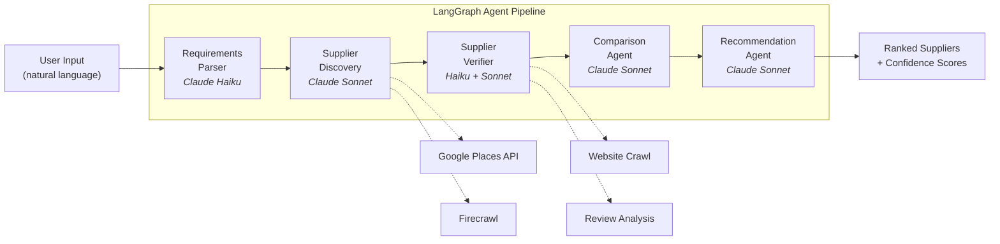

# Procurement AI — AI-Powered Procurement for Small Businesses

An AI agent system that automates supplier discovery, verification, and comparison for small business founders. Describe what you need in plain language, and a 5-agent pipeline finds suppliers, vets them against multiple signals, compares options side-by-side, and delivers ranked recommendations with confidence scores.


## The Problem

Small business founders spend 10-20+ hours researching suppliers for every new product or service they need. They're Googling, reading reviews, calling businesses, and building comparison spreadsheets by hand — time they should be spending growing their business.

## What It Does

- **Natural Language Input** — Describe what you need ("I need a packaging supplier for organic snacks, food-safe, minimum order 500 units, Bay Area preferred") and the system handles the rest
- **Automated Discovery** — Searches Google Places and crawls supplier websites via Firecrawl to build a candidate list
- **Multi-Signal Verification** — Cross-references supplier websites, reviews, and registration data to assess legitimacy
- **Side-by-Side Comparison** — Generates a structured comparison matrix across price, quality, lead time, MOQ, and certifications
- **Ranked Recommendations** — Final picks with confidence scores and reasoning you can act on

## Architecture



Each agent receives and passes **typed state** (Pydantic models) to the next stage. The orchestrator is a LangGraph graph with explicit edges and state transitions.

## Technical Highlights

- **Cost-Optimized Model Routing** — Haiku handles cheap tasks (parsing, extraction) while Sonnet handles tasks that need reasoning (discovery strategy, comparison analysis, final recommendations). This keeps costs ~3x lower than using Sonnet for everything.
- **Typed Agent State** — All inter-agent communication uses Pydantic models (`agent_state.py`), so state transitions are validated at runtime. No stringly-typed data passing between agents.
- **Real External API Integration** — This isn't a toy. The discovery agent hits Google Places for real business data and Firecrawl for website content extraction. The verifier cross-references multiple signals.
- **LangGraph Orchestration** — The pipeline is defined as a LangGraph graph with explicit nodes and edges, not a simple chain. Each agent can be tested independently.

## Tech Stack

| Layer | Technology |
|-------|-----------|
| Backend | Python, FastAPI |
| Orchestration | LangGraph (stateful agent pipeline) |
| LLM | Anthropic Claude — Haiku (parsing) + Sonnet (reasoning) |
| Frontend | Next.js, Tailwind CSS |
| Database | Supabase (PostgreSQL + pgvector) |
| External | Google Places API, Firecrawl (web scraping) |

## Running Locally

```bash
# Backend
pip install -r requirements.txt
cp .env.example .env  # Add: ANTHROPIC_API_KEY, GOOGLE_PLACES_KEY, FIRECRAWL_KEY
uvicorn app.main:app --reload

# Frontend
cd frontend && npm install && npm run dev
```

## Project Structure

```
app/
├── agents/
│   └── orchestrator.py         # LangGraph pipeline — nodes, edges, state graph
├── schemas/
│   └── agent_state.py          # Pydantic models for all inter-agent state
├── api/
│   └── v1/projects.py          # REST endpoints (create project, poll status)
└── main.py                     # FastAPI entrypoint

frontend/
├── src/app/page.tsx            # Main UI
└── ...
```

## Status

MVP — core pipeline working end-to-end. Next: persistent storage, async job processing, richer comparison UI.
